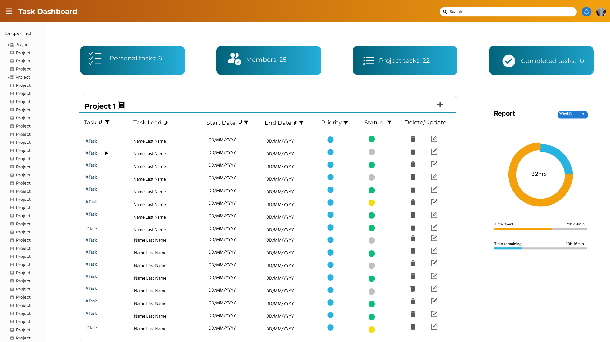

# Dobrodošli u PlanIT!

## Kratak opis projekta

PlanIT je alat za upravljanje softverskim projektima koji kombinuje prednosti tradicionalnih i agilnih metoda. Tradicionalne metode pružaju jasan vremenski plan aktivnosti, dok su agilne metode fleksibilne i prilagodljive promenama. Cilj PlanIT-a je da obezbedi korisnicima jednostavan i efikasan alat koji će zadovoljiti njihove specifične potrebe.

## Motivacija

Kroz decenije, upravljanje projektima se menjalo, od tradicionalnih do agilnih metoda. Tradicionalne metode su često rigidne, dok agilne metode pružaju fleksibilnost, ali nedostaje im dugoročna slika. Postoji mnogo alata na tržištu, ali retko koji može potpuno da zadovolji specifične zahteve svakog tima. PlanIT nastoji da ispuni tu prazninu pružajući jednostavan i prilagodljiv alat za upravljanje projektima.

## Instalacija

Za instalaciju *PlanIT*-a, pratite sledeće korake:

1. Klonirajte ovaj repozitorijum na svoj lokalni sistem.
2. Pokrenite instalaciju pomoću priloženih uputstava.
3. Prilagodite alat svojim specifičnim potrebama i uživajte u upravljanju svojim projektima!

## Uputstvo za korišćenje

Uputstvo za korišćenje možete pronaći na sledećem [linku](https://gitlab.pmf.kg.ac.rs/si2024/planit/-/blob/master/docs/Uputstvo_PlanIT.pdf)

## Pristup aplikaciji

Aplikaciji možete pristupi na severu prirodno-matematičkog fakulteta na portu 10152. 
http://softeng.pmf.kg.ac.rs:10152/

Za logovanje, kredencijali grupa korisnika su sledeći :

1. Administrator 

username : admin

password : admin123


2. Menadžer projekta

username : marija_jolovic

password : marija123


3. Zaposleni radnik 

username : nikola_lalic

password : nikola123

## Pokretanje Aplikacije

### Deploy 

U terminalu iz putanje _planit/src/backend/PlanIT/PlanIT :

1. 
    ```bash
    dotnet publish -c Release -o out
    ```

Na ovaj nacin, kreira se out folder koji sadrzi sve foldere sa odgovarajucim .dll fajlovima.

Nakon povezivanja na server, /out folder potrebno je deploy-ovati na server :

2.
    ```bash
    scp -r out planit@softeng.pmf.kg.ac.rs:/home/planit/back
    scp planit.db planit@softeng.pmf.kg.ac.rs:/home/planit/back/out
    ```

U terminalu iz putanje _planit/src/frontend/angular\_project/angular__ :

3.  
    ```bash
    ng build --configuration=production
    ```

Na ovaj nacin, kreira se dist folder koji sadrzi sve foldere sa odgovarajucim fajlovima.

Nakon povezivanja na server, /dist folder potrebno je deploy-ovati na server : 

4. 
    ```bash
    scp -r dist planit@softeng.pmf.kg.ac.rs:/home/planit/front
    scp error_skripta.py planit@softeng.pmf.kg.ac.rs:/home/planit/front/dist/angular/browser
    ```

##### Pokretanje sa servera
**Nakon povezivanja na server**

Sa jednog terminala : 
```bash
cd front/dist/angular/browser
python3 -m http.server 10152

python3 error_skripta.py
```
    
Sa drugog terminala : 
```bash
cd back/out
dotnet PlanIT.dll --urls=http://0.0.0.0:10151/
```
Posetite [PlanIT](http://softeng.pmf.kg.ac.rs:10152/) u vašem web pregledaču.


### Debug Verzija

U terminalu iz putanje _planit/src/frontend/angular\_project/angular__ :

1. Instalirajte sve zavisnosti koristeći npm:

    ```bash
    npm install [--force]
    ```

2. Pokrenite Angular CLI razvojni server:

    ```bash
    ng serve [--open]
    ```

3. Posetite `http://localhost:4200/` u vašem web pregledaču.

## Pokretanje .NET backend dela aplikacije
 
```bash
dotnet build
```
## Pokretanje Baze Podataka (SQLite)

1. Za korišćenje baze, potrebno je uraditi migraciju baze na način opisan [ovde.](https://gitlab.pmf.kg.ac.rs/si2024/planit/-/blob/master/src/backend/PlanIT/README.md), iz _Package Manager Console_ terminala, dok je otvoren solution.

2. Otvaranje baze se moze vrsiti preko [ DB Browser for SQLite ](https://sqlitebrowser.org/), koji je prvo potrebno instalirati a zatim i otvoriti **planit.db** bazu podataka koju migracija kreira.

### Dodatne Informacije

## Učesnici na projektu

- **Marija Jolović (Student ID: 46/2021)**
- Nikola Lalić (Student ID: 52/2021)
- Đorđe Todorović (Student ID: 87/2021)
- Aleksandar Milanović (Student ID: 62/2020)
- Aleksandar Milutinović (Student ID: 63/2020)
- Danilo Novaković (Student ID: 101/2018)


## Kontakt

Za više informacija ili podršku, možete nas kontaktirati na:

- Email: plan.it.2024@hotmail.com

Hvala vam što koristite PlanIT!

## Galerija


