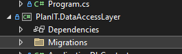
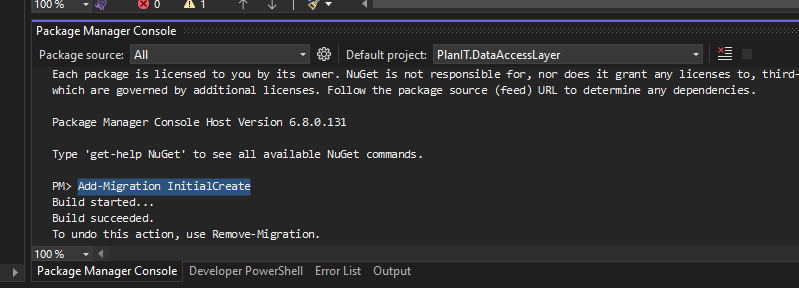
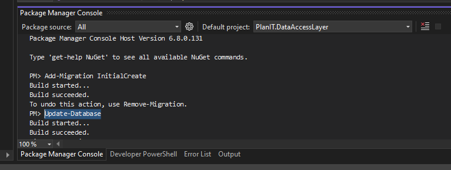

# Uputstvo za Postavljanje Baze

Ovo uputstvo će vas voditi kroz proces kreiranje .db baze pozadataka.

## Uputstva

### 1. Obrišite Migrations Folder

Ukoliko vec postoji, obrišite Migrations folder iz vašeg backend projekta, kao i **planit.db** bazu.

### 2. Dodajte Migraciju

U Package Manager Console, uverite se da je Default project postavljen na PlanIT.DataAccessLayer, zatim izvršite sledeću komandu:

`Add-Migration InitialCreate`

### 3. Azurirajte Bazu Podataka

Na kraju, izvršite sledeću komandu u Package Manager Console:

`Update-Database`

Nakon izvršavanja prethodnih komandi, **planit.db** baza podataka ce se pojaviti u PlanIT direktorijumu, koju zatim mozete otvoriti koriscenjem DB Browser-a.

